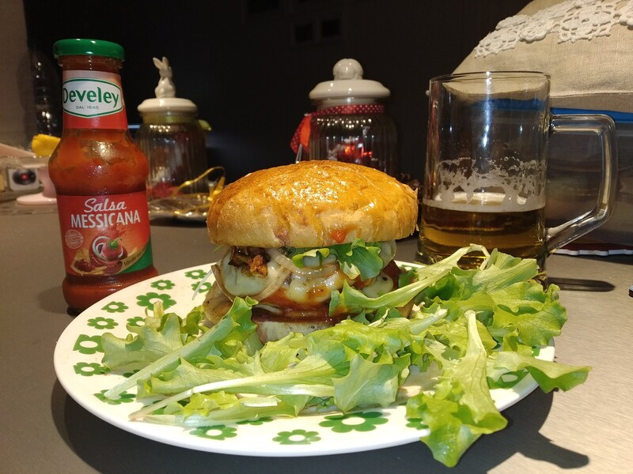

Da <a href="https://www.youtube.com/watch?v=ySeb07GwP8M">Cicciogamer</a>

## Ingredienti
- 300 gr. farina (minimo 12g proteine)
- 150 gr. manitoba
- 180 ml acqua
- mezzo bicchiere di latte
- 1 uovo intero più un rosso
- 50 gr. zucchero
- 15 gr. sale
- 7 gr. lievito secco
- 30 gr. burro

## Preparazione
- mescolare farine, lievito, zucchero
- aggiungi uovo, burro ammorbidito
- mentre si impasta, aggiungi acqua tiepida
- aggiungi sale
- impasta
- lavorare sul tavolo (8 minuti), sbattere
- fare la pallina, lievitare per 2 ore in tupperware oliato
- spolverare di farina, fare rotolo e dividere in 6 palline
- mettere a far lievitare 1 h sulla teglia con carta forno, in forno, coperti
- spennellare con latte e rosso d'uovo
- forno statico 200° 15 min 
 

