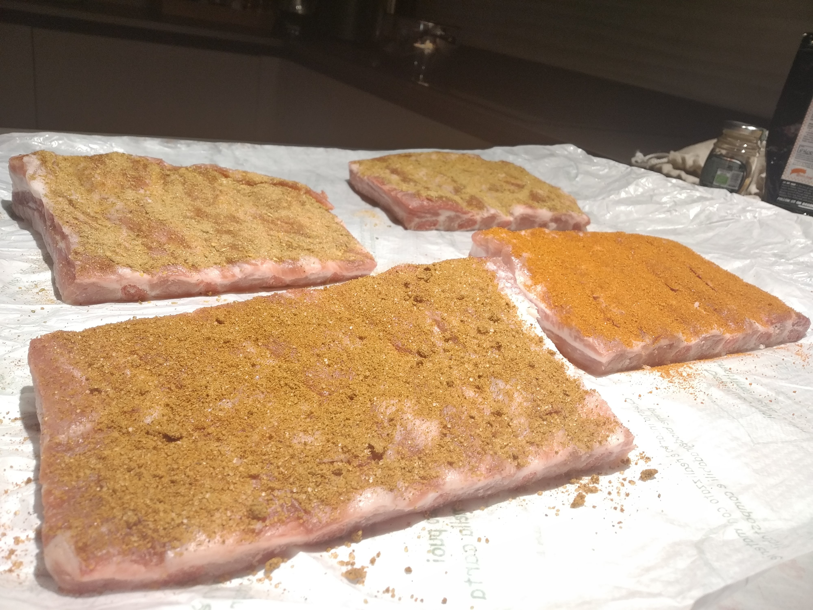
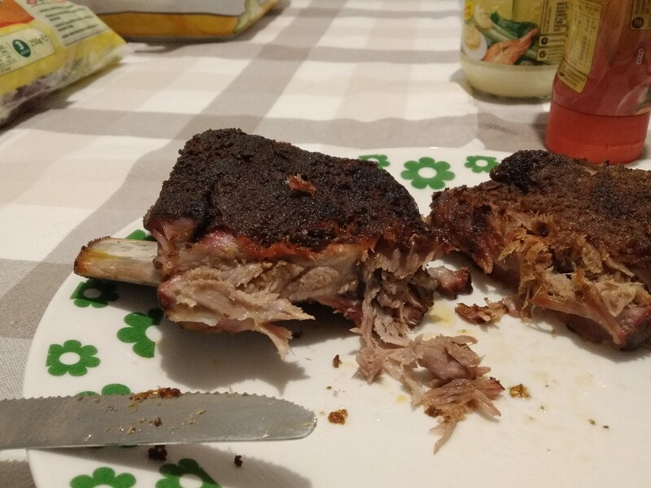

## Ingredienti
- 1kg costine di maiale
- rub

## Preparazione
- lasciare riposare 45' dopo aver messo il Rub
- 1h 120-150 °C affumicatura pecan, dopo 2h circa in foiling a 150 °C
- acqua nella vaschetta
- fare asciugare a 120-150°C (circa 2 ore)
- 1h 1h 30m in foiling a circa 160°
- giro ad alta temperatura alla fine, senza stagnola, eventualmente aggiungere mezza ciminiera piccola di carbone, raggruppato in un unico cesto

|tempo |BBQ
|-----|-----|
00:00 | 150
00:30 | 130
01:00 | 140
01:30 | 130
02:00 | 130 <-- in foiling
02:30 | 160
03:00 | 160 <-- passare a 180°
03:20 | 180

