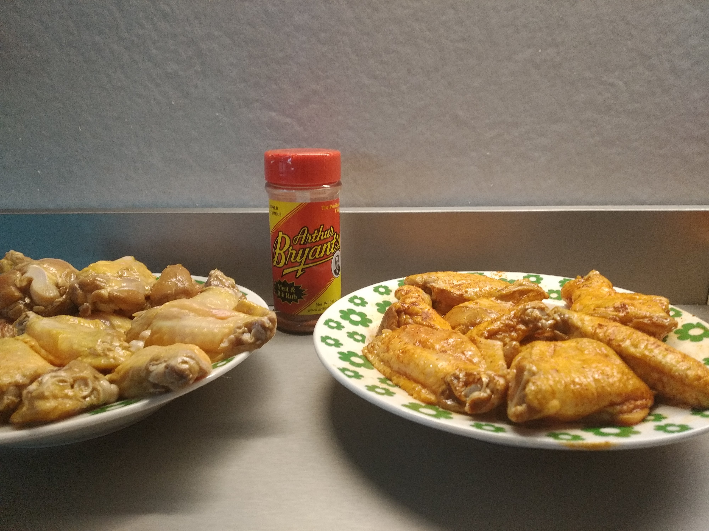

Ali di pollo marinate al barbecue

### Ingredienti

- ali di pollo
- marinatura: [marinatura 1]()
- rub: [Rub Arthur Briant's]()

### Preparazione
- separare le ali nelle articolazioni, buttare le punte (o farci il brodo)
- 24 ore di marinatura, asciugare prima di andare in griglia.
- 180 °C, 45 minuti (85 °C all' interno) giro veloce in diretta.
- Affumicare con hickory, melo è poco presente

Se con Rub, attenzione a non bruciarle. 
