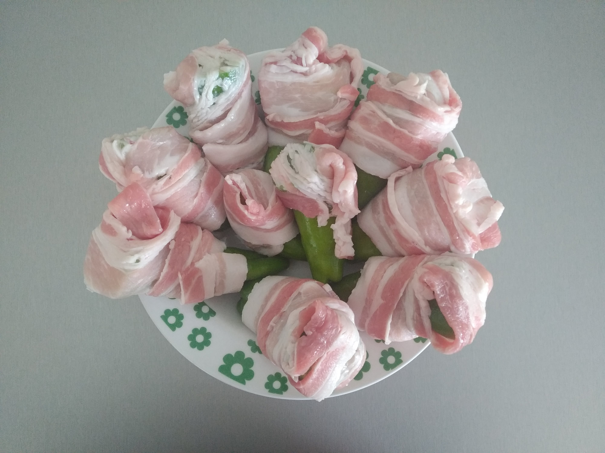

## Ingredienti
- 10 friggitelli
- formaggio (asiago, latteria, auricchio, ...)
- 10 fette di pancetta

Pulire i peperoni, riempire di formaggio, chiudere con la pancetta. Cuocere in indiretta a 180° C, per circa un'ora, finché la pancetta non è croccante.
