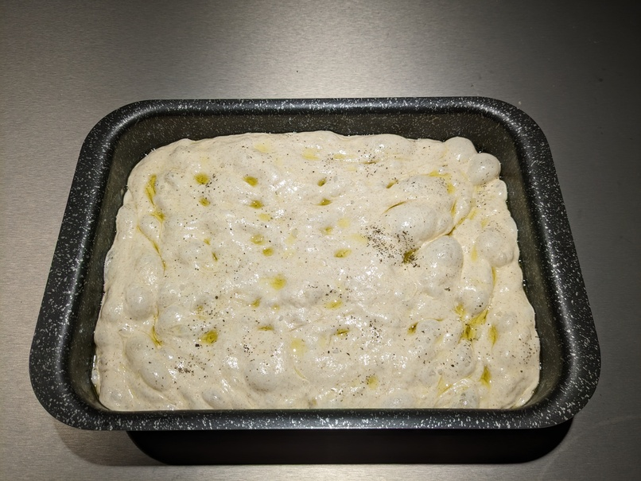

## Ingredienti
- 600 g farina tipo 0 minimo 12 g proteine
- 480 ml acqua temperatura ambiente
- 12 g sale
- 5 g lievito di birra fresco (2 g secco)
- olio oliva
- sale grosso
- rosmarino 

## Preparazione
Sciogli il lievito nell'acqua, aggiungi 3 cucchiai d'olio. Setaccia la farina, inserisci la parte liquida.
Riposo per 15 minuti nella terrina da impasto.

Aggiungi sale e mescola. Fai alcune pieghe con le mani bagnate. Riposo 15 minuti sul piano di impasto.

Fai altre pieghe e metti a riposare per 90 minuti nella terrina unta, coperta con panno.

Ungi la teglia con molto olio, versa l'impasto e fai altre pieghe, aggiungi olio sopra e fai riposare per 40 minuti.

Stendi con le dita, aggiungi olio, sale grosso e rosmarino. Scalda il forno statico a 240 °c, inforna 10 minuti sul ripiano basso, poi 10/12 minuti sul centrale.
 
 
